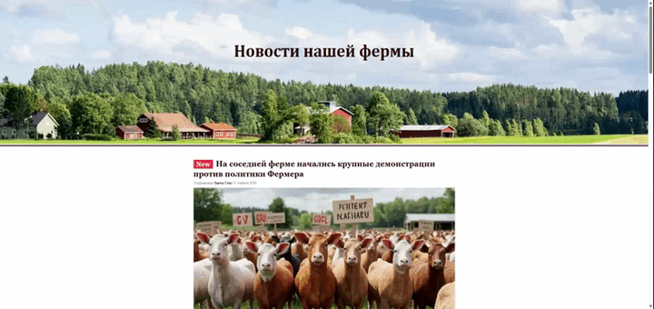

# Агентство новостей «Скотный двор»

Проект новостной страницы разработан в качестве практического задания на курсе «Профессия Fullstack веб-разработчик на JavaScript и PHP».

## Используемые технологии

* HTML
* CSS Flexbox

## Как открыть в браузере

Откройте корневую папку в файловом менеджере. В папке дважды кликните файл index.html. Если система не распознала файл, то выберите любой браузер, который установлен на компьютере.

## Demo

Демо проекта: https://hajdukow.github.io/hw-03-news/

